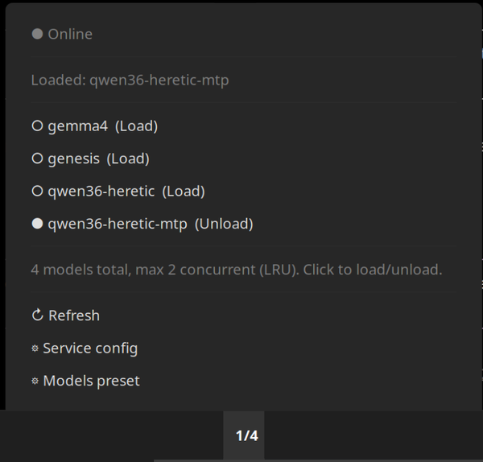

# llama-router-applet

Cinnamon panel applet for [llama.cpp](https://github.com/ggml-org/llama.cpp) router mode — load, unload, and switch models from your desktop panel.



> **28 tok/s on a laptop?** See the [35B MTP setup report in llmlab](https://github.com/githabideri/llmlab/blob/main/reports/2026-07-24_report_35b-mtp-laptop-setup.md) — running Qwen3.6-35B at 28 tokens/second on a Ryzen 7840U with integrated graphics. Full benchmark, configs, and reproduction guide.

## What this is

A lightweight panel applet that integrates with llama.cpp's built-in router API. Shows how many models are loaded, lets you load/unload individual models with a click, and links directly to your config files.

**No dependencies beyond `curl`.** Uses raw TCP via Cinnamon's `Util.spawn_async` — no Python, no Node, no systemd dbus.

## Features

- **Panel label:** Shows `N/M` (loaded/total models)
- **Left-click menu:** List all models with ● (loaded) / ○ (unloaded) / ◐ (loading) status
- **Direct load/unload:** Click any model to toggle it (uses `/models/unload` API)
- **Offline mode:** Shows status and restart button when router is unreachable
- **Config shortcuts:** Direct links to `llama-router.service` and `models.ini`
- **Auto-refresh:** Polls router every 5 seconds

## Requirements

- **Cinnamon** 5.x / 6.x (tested on 6.4.13)
- **llama.cpp** with router mode (`--models-preset`), running on `127.0.0.1:8082`
- **curl** (for HTTP requests to the router)

## Install

### Quick install

```bash
# Clone the repo
git clone https://github.com/githabideri/llama-router-applet.git

# Copy to your applets directory
cp -r llama-router-applet ~/.local/share/cinnamon/applets/llama-router@githabideri

# Reload Cinnamon: Alt+F2 → type 'r' → Enter
```

### From source (development)

```bash
# Clone and symlink for live editing
git clone https://github.com/githabideri/llama-router-applet.git
ln -s $(pwd)/llama-router-applet ~/.local/share/cinnamon/applets/llama-router@githabideri
```

### Uninstall

```bash
rm -rf ~/.local/share/cinnamon/applets/llama-router@githabideri
# Reload Cinnamon: Alt+F2 → 'r' → Enter
```

## Configuration

The applet connects to `http://127.0.0.1:8082` by default. To change the port or host, edit `applet.js` and update the URLs in `fetchModels()` and `loadModel()`/`unloadModel()`.

### Router setup

The applet expects llama.cpp router mode with `--models-preset`. Example service:

```ini
[Service]
ExecStart=/path/to/llama-server \
  --models-preset /path/to/models.ini \
  --host 127.0.0.1 \
  --port 8082 \
  --models-max 2
```

See [llama.cpp server docs](https://github.com/ggml-org/llama.cpp/blob/master/docs/server.md) for full setup.

## API Endpoints Used

| Method | Endpoint | Purpose |
|--------|----------|---------|
| `GET` | `/models` | List models + status |
| `POST` | `/models/unload` | Unload a specific model |
| `POST` | `/v1/chat/completions` | Load model (via probe request) |

The `/models/unload` endpoint was added in llama.cpp b480+. Older builds may not support direct unloading.

## File Structure

```
cinnamon-llama-router-applet/
├── README.md              # This file
├── LICENSE                # GPL-3.0
├── screenshot.png         # Preview image
├── metadata.json          # Applet metadata (name, UUID, version)
└── applet.js              # Main applet code
```

The entire repo **is** the applet directory. Copy it as `llama-router@githabideri` into your applets folder.

## Development

### Testing changes

With the symlink install method, changes to `applet.js` take effect immediately after reloading Cinnamon (`Alt+F2` → `r`).

### Debugging

Check Cinnamon logs for applet errors:

```bash
grep "llama-router" ~/.xsession-errors
```

### Contributing

1. Fork the repository
2. Create a feature branch
3. Submit a pull request

Issues and feature requests: [GitHub Issues](https://github.com/githabideri/llama-router-applet/issues)

## License

GPL-3.0 — see [LICENSE](LICENSE) for details.

## Credits

- Built for [llama.cpp](https://github.com/ggml-org/llama.cpp) router mode
- Inspired by the [temperature@fevimu](https://github.com/linuxmint/cinnamon-spices-applets/tree/master/temperature@fevimu) applet structure
- Router API documented by [glukhov.org](https://www.glukhov.org/llm-hosting/llama-cpp/unload-llama-cpp-router-models/)
